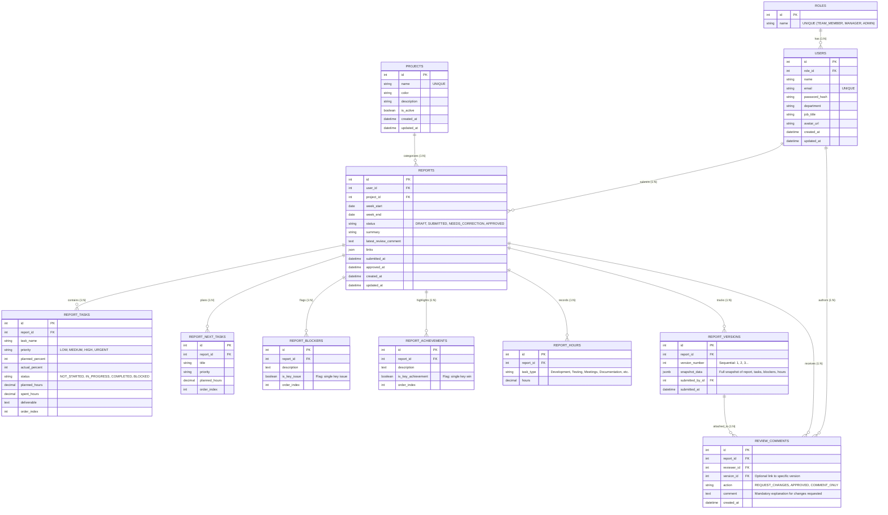

# Database Entity-Relationship (ER) Design

This document details the database schema, entity definitions, and relationship architecture for the **Weekly Report Generator & Team Dashboard** system.

The schema is built for **PostgreSQL** using **Prisma ORM** and is illustrated in the visual diagram deliverable:
- [er-diagram.svg](./er-diagram.svg)

---

## 1. Entity-Relationship Diagram (Mermaid)



---

## 2. Core Entities & Technical Descriptions

### `roles`
Defines Role-Based Access Control (RBAC) levels.
- `TEAM_MEMBER`: Can create, edit, draft, and submit own reports. Can view own history and respond to revision comments.
- `MANAGER`: Can view all team reports, view aggregate analytics dashboard, approve reports, and request corrections with comments.
- `ADMIN`: Has full managerial capabilities plus user role assignment and project administration.

### `users`
Accounts for system access. Stores hashed passwords using `bcrypt` and references role hierarchy.

### `projects`
Work categories/projects (e.g. `Client A`, `Internal Tooling`, `R&D`, `Marketing`). Provides tag-based filtering and workload distribution analytics.

### `reports`
Central aggregate entity representing a team member's weekly report for a date range (Monday to Sunday).
Fixed lifecycle:
```
[DRAFT] ---> [SUBMITTED] ---> [NEEDS_CORRECTION] ---> [SUBMITTED] ---> [APPROVED]
```

### `report_tasks`
Structured task rows containing:
- Planned vs actual progress percentage
- Status (`NOT_STARTED`, `IN_PROGRESS`, `COMPLETED`, `BLOCKED`)
- Planned hours vs actual spent hours
- Deliverable output produced (PR links, documents, build artifacts)

### `report_blockers` & `report_achievements`
Individual challenges and accomplishments. Supports boolean flags `is_key_issue` and `is_key_achievement` allowing managers to instantly spot critical week highlights.

### `report_hours`
Time allocation category breakdown (Development, Testing, Code Review, Meetings, Documentation).

### `report_versions` & `review_comments` (Bonus Feature)
Ensures full audit compliance. Whenever a report is submitted or resubmitted after correction:
- An immutable snapshot of the report state is archived in `report_versions`.
- Any reviewer feedback is tied to the report and version, preserving historical context.
